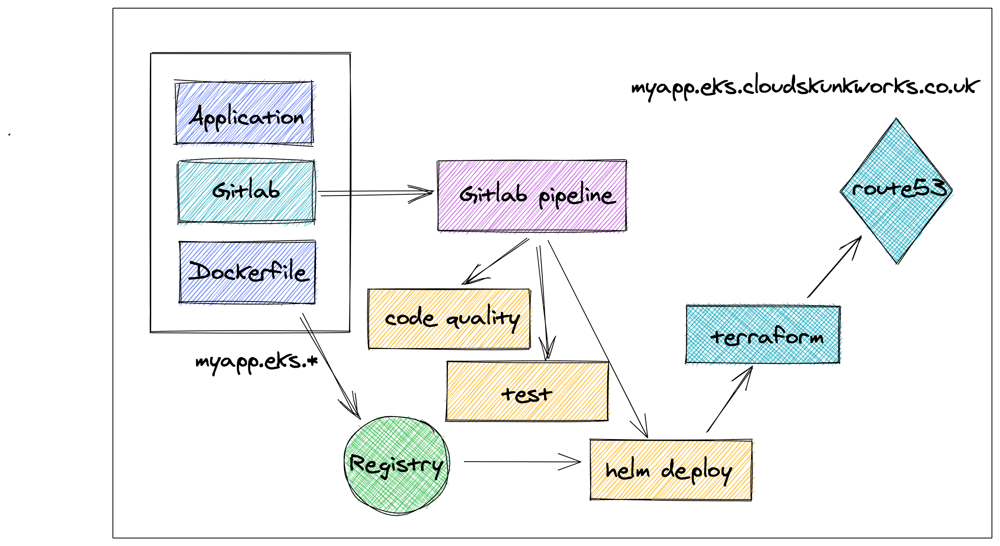

## sre-infra-aws

This project contains resources for SRE infrastructure to be deployed to AWS.
It sets up an EKS cluster with the appropriate resources for managing tenants of that cluster through CI/CD and automating ingress to their applciations.


Requirements:
- kubectl
- helm
- tfenv
- awscli




## Infrastructure

```
 NAME                                                                                          MONTHLY QTY  UNIT        PRICE   HOURLY COST  MONTHLY COST

  module.cluster.aws_route53_record.eks_domain_cert_validation_dns["*.cloud-skunkworks.co.uk"]
  └─ Standard queries                                                                                     -  1M queries  0.4000            -             -
  Total                                                                                                                                    -             -

  module.cluster.aws_route53_record.eks_domain_cert_validation_dns["cloud-skunkworks.co.uk"]
  └─ Standard queries                                                                                     -  1M queries  0.4000            -             -
  Total                                                                                                                                    -             -

  module.cluster.module.eks.aws_autoscaling_group.workers[0]
  └─ module.cluster.module.eks.aws_launch_configuration.workers[0]
     ├─ Linux/UNIX usage (spot, c4.xlarge)                                                            2,190  hours       0.0694       0.2082      151.9860
     ├─ EBS-optimized usage                                                                           2,190  hours       0.0000       0.0000        0.0000
     ├─ EC2 detailed monitoring                                                                          21  metrics     0.3000       0.0086        6.3000
     └─ root_block_device
        └─ General Purpose SSD storage (gp2)                                                            300  GB-months   0.1000       0.0411       30.0000
  Total                                                                                                                               0.2579      188.2860

  module.cluster.module.eks.aws_eks_cluster.this[0]
  └─ EKS cluster                                                                                        730  hours       0.1000       0.1000       73.0000
  Total                                                                                                                               0.1000       73.0000

  module.cluster.module.vpc.aws_eip.nat[0]
  └─ IP address (if unused)                                                                               -  hours       0.0050            -             -
  Total                                                                                                                                    -             -

  module.cluster.module.vpc.aws_nat_gateway.this[0]
  ├─ NAT gateway                                                                                        730  hours       0.0450       0.0450       32.8500
  └─ Data processed                                                                                       -  GB          0.0450            -             -
  Total                                                                                                                               0.0450       32.8500

  OVERALL TOTAL (USD)                                                                                                                 0.4029      294.1360
```

## Installation

1. `aws s3 mb s3://sre-infra-aws-cloud-skunkworks --region eu-west-2`
2. `cd terraform && terraform apply -target=module.cluster && terraform apply -target=module.deployment`
3. `aws eks --region eu-west-2 update-kubeconfig --name sre-infra`


### Post Installation


0. `aws eks update-kubeconfig --name sre-infra --region eu-west-2`

1. Gitlab ingress will expect additional annotations to load the ACM certificate and terminate TLS at the ELB.

```
# Run this from ./terraform directory

kubectl annotate svc/gitlab-nginx-ingress-controller -n gitlab service.beta.kubernetes.io/aws-load-balancer-backend-protocol=https --overwrite
kubectl annotate svc/gitlab-nginx-ingress-controller -n gitlab service.beta.kubernetes.io/aws-load-balancer-ssl-ports=https --overwrite
kubectl annotate svc/gitlab-nginx-ingress-controller -n gitlab service.beta.kubernetes.io/aws-load-balancer-ssl-cert=$(terraform output aws_acm_certificate | sed -e 's/^"//' -e 's/"$//') --overwrite
```

2. `kubectl get secret/gitlab-gitlab-initial-root-password -n gitlab -ojsonpath='{.data.password}' | base64 --decode ; echo` for the gitlab password.

3. Add the sre-infra cluster into the Gitlab Kubernetes integration [guide here](https://gitlab.cloud-skunkworks.co.uk/help/user/project/clusters/add_remove_clusters.md#add-existing-cluster)

4. Apply `kubectl apply -f kubernetes/gitlab-serviceaccount.yaml`

5. Use `terraform refresh` to reveal the token, cert and API URL to link the cluster within gitlab.
