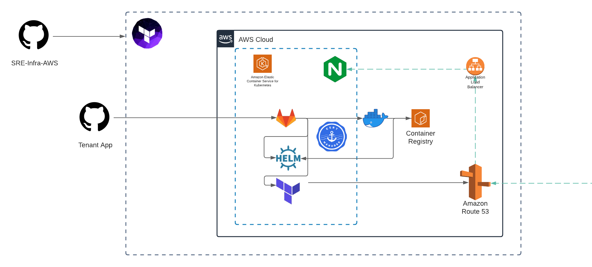

## sre-infra-aws

This project contains resources for SRE infrastructure to be deployed to AWS.
It sets up an EKS cluster with the appropriate resources for managing tenants of that cluster through CI/CD and automating ingress to their applciations.


Requirements:
- kubectl
- helm
- tfenv
- awscli




## Infrastructure 

```
  NAME                                                                          MONTHLY QTY  UNIT        PRICE   HOURLY COST  MONTHLY COST

  aws_route53_record.eks_domain_cert_validation_dns["*.crystalbasilica.co.uk"]
  └─ Standard queries                                                                     -  1M queries  0.4000            -             -
  Total                                                                                                                    -             -

  aws_route53_record.eks_domain_cert_validation_dns["crystalbasilica.co.uk"]
  └─ Standard queries                                                                     -  1M queries  0.4000            -             -
  Total                                                                                                                    -             -

  aws_route53_record.gitlab_minio_subdomain
  └─ Standard queries                                                                     -  1M queries  0.4000            -             -
  Total                                                                                                                    -             -

  aws_route53_record.gitlab_registry_subdomain
  └─ Standard queries                                                                     -  1M queries  0.4000            -             -
  Total                                                                                                                    -             -

  aws_route53_record.gitlab_subdomain
  └─ Standard queries                                                                     -  1M queries  0.4000            -             -
  Total                                                                                                                    -             -

  module.eks.aws_autoscaling_group.workers[0]
  └─ module.eks.aws_launch_configuration.workers[0]
     ├─ Linux/UNIX usage (on-demand, m4.large)                                        2,190  hours       0.1000       0.3000      219.0000
     ├─ EC2 detailed monitoring                                                          21  metrics     0.3000       0.0086        6.3000
     └─ root_block_device
        └─ General Purpose SSD storage (gp2)                                            300  GB-months   0.1000       0.0411       30.0000
  Total                                                                                                               0.3497      255.3000

  module.eks.aws_autoscaling_group.workers[1]
  └─ module.eks.aws_launch_configuration.workers[1]
     ├─ Linux/UNIX usage (on-demand, m4.large)                                        1,460  hours       0.1000       0.2000      146.0000
     ├─ EC2 detailed monitoring                                                          14  metrics     0.3000       0.0058        4.2000
     └─ root_block_device
        └─ General Purpose SSD storage (gp2)                                            200  GB-months   0.1000       0.0274       20.0000
  Total                                                                                                               0.2332      170.2000

  module.eks.aws_eks_cluster.this[0]
  └─ EKS cluster                                                                        730  hours       0.1000       0.1000       73.0000
  Total                                                                                                               0.1000       73.0000

  module.vpc.aws_nat_gateway.this[0]
  ├─ NAT gateway                                                                        730  hours       0.0450       0.0450       32.8500
  └─ Data processed                                                                       -  GB          0.0450            -             -
  Total                                                                                                               0.0450       32.8500

  OVERALL TOTAL (USD)                                                                                                 0.7279      531.3500
```

### Terraform

- Creates security groups, workers, EKS, ELB and other AWS resources.
- User will be prompted to create an S3 bucket "sre-infra-aws" to hold terraform state if it does not exist.

_Check the terraform/vars.tf as it will need the domain name configured_

```
./bootstrap.sh
```

And for deletion/cleanup

```
./destroy.sh
```

### Troubleshooting

_Destroy is not tearing down my VPC or has an error_

Check that there aren't dangling resources such as an ELB created by Kubernetes.


_Load balancing doesn't work or I can't externally hit it correctly_

This installation provides TLS termination at the apex domain with a wildcard, this is worth knowing as ELB/NLB/ALB won't function correctly if you are using a typical ingress class configuration,
you'll need to redirect HTTPS->HTTP locally. 

You'll see this has been done as part of the helm configuration for the default ingress.
